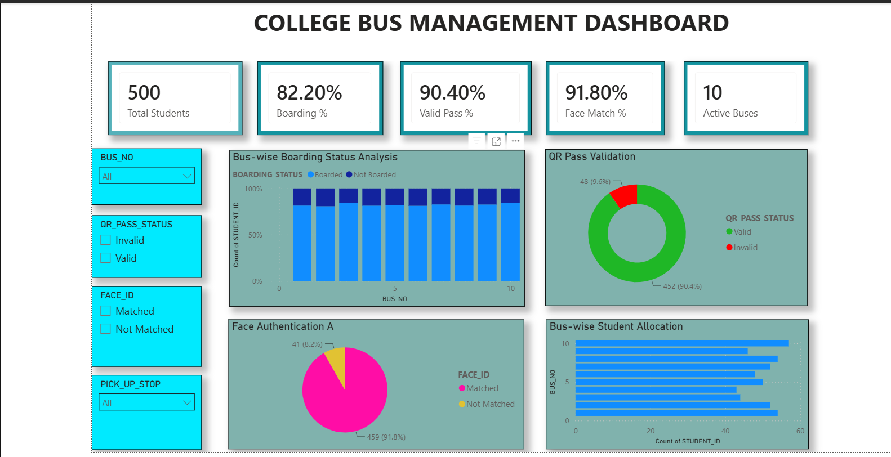
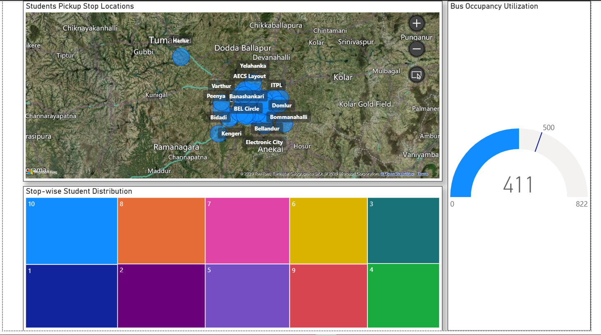
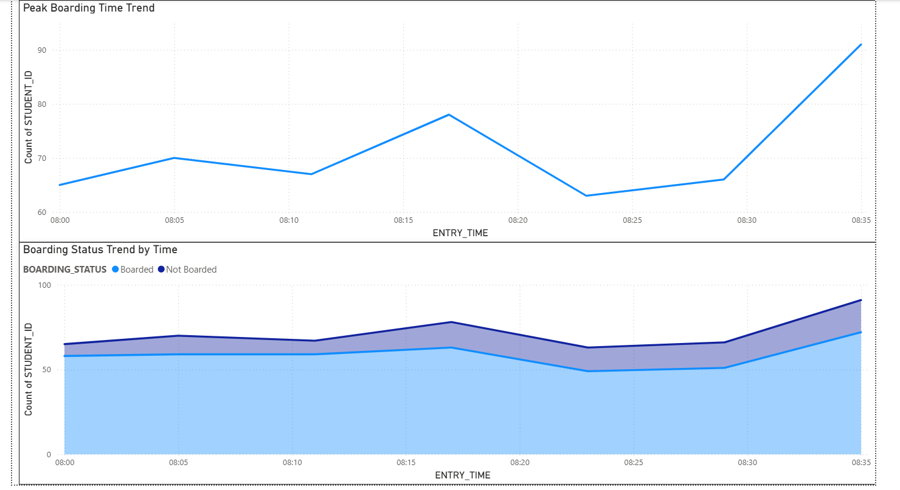
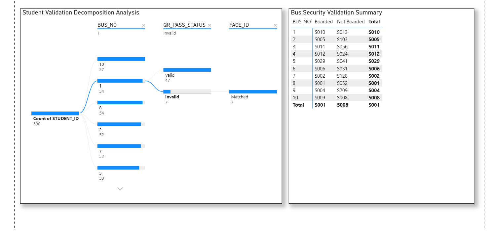

# College Bus Management Dashboard

## Project Overview

This Power BI dashboard provides insights into college bus transportation operations, including:

- Student boarding analysis
- QR pass validation
- Face authentication verification
- Bus occupancy utilization
- Pickup stop distribution
- Boarding time trends

## Tools Used

- Power BI Desktop
- Microsoft Excel
- DAX
- Data Visualization

## Dashboard Screenshots

### Main Dashboard

### Validation Analysis

### Boarding Trend

### Pickup Stop Analysis

## Files

- DVBI_Project.pbix
- Updated_Bus_Boarding_80_85.xlsx
